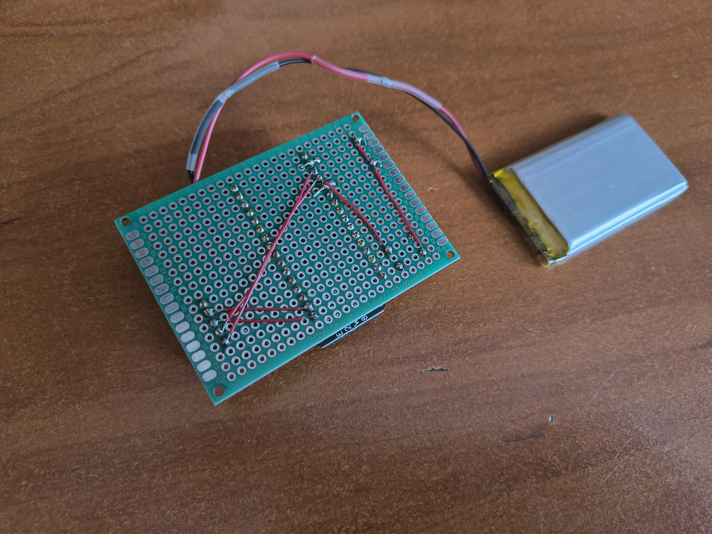

# Purpose

Software to run on WorCube.

# What is WorkCube

WorkCube is a device that, as a cube, has six faces, and each of them symbolizes an activity, such as programming, meeting, break, etc. The user picks up one of the activities and puts it face up. The WorkCube detects it and sends information via Bluetooth (BLE) to the paired device that the user started doing it. This allows the user to see on the other device how he spends his day.

## Example

User comes to work and turns on the laptop and WorkCube. When he starts programming, he puts WorkCube with a face that indicates programming up, which is detected by WorkCube and sent to the paired laptop. Then the user goes to a meeting and puts the proper face of the cube up. It detects a change and sends info to the laptop. At the end of the day, the user can see what, when and how long he was doing certain activities.

# Structure

The device was build using:

- Adafruit ESP32 Feather - as a main micro-procesor
- MPU-6050 - as a gyroscope sensor

It works on battery and and is able to safe energy by going into deep sleep mode.

Sensor and micro-procesor are connected with I2C bus.

